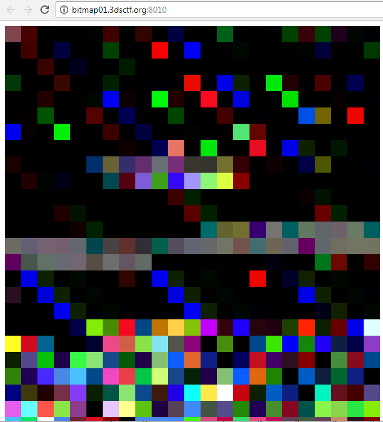
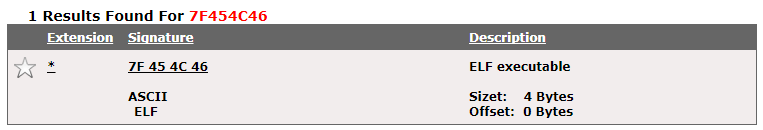
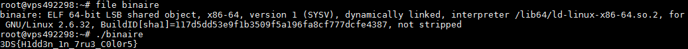

# Wargames, Forensics, 500pts

## Problem

We are given a link that contains a bunch of colored rectangles -



## Solution

We examine the source code we have an html table with hex colors, googling the first hex value (7F454C46) we found that is a signature of an executable linux file



We conclude that there is a hidden ELF inside colors, so we wrote a python script to extract these color values and save them in a file

```python
from bs4 import BeautifulSoup as bs
import binascii
import urllib2

html = urllib2.urlopen('http://bitmap01.3dsctf.org:8010/')
soup = bs(html, 'lxml')
bytes = ''
tds = soup.findAll('td')

for td in tds:
	bytes += binascii.a2b_hex(td['bgcolor'].replace('#', ''))

file = open('bitmap', 'wb')
file.write(bytes)
file.close()
```

We see that the file `bitmap` is an ELF. We run it to get the flag.



So, the flag is `3DS{H1dd3n_1n_7ru3_C0l0r5}`.
