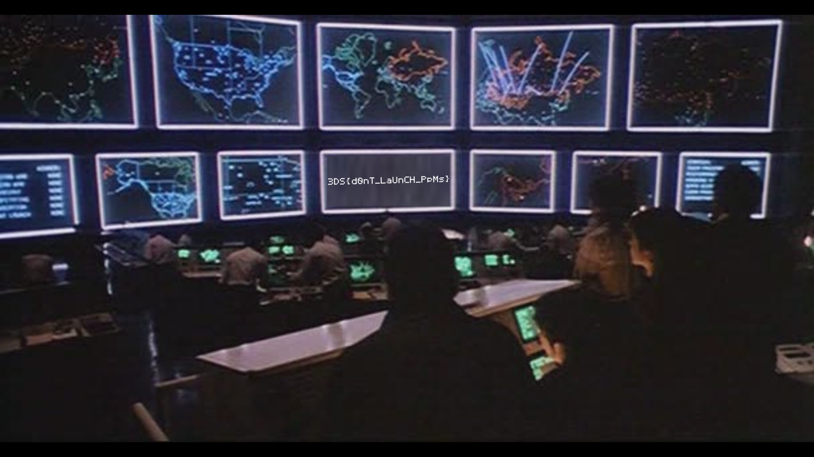

# Wargames, Forensics, 500pts

## Problem

Here is the given PPM file -


## Solution

Ppm, pbm, and pgm are images in Netpbm format. These were first invented in the 1980s as way to represent an image file in plain ASCII Text.

The first line of one of these files should have a magic number to identify whether it is a ppm, pgm or pbm and its encoding (ASCII or binary). This should be followed by a line with the picture dimensions and a line with the color range. After that comes the actual picture information.

A quick search provides the following information for magic numbers:

| Extension | ASCII | Binary |
|-----------|-------|--------|
| .pbm      | P1    | P4     |
| .pgm      | P2    | P4     |
| .ppm      | P3    | P6     |

Opening the given ppm file in vim to examine it, we see the first few lines are -
```
P4
1920 1080
255
...
```
This is a ppm file, but the magic number signifies that it is a binary-encoded pbm file.

Simply by replacing P4 with P6:

```
P6
1920 1080
255
...
```

and saving and exiting the file, my computer was able properly interpret and display the actual image:



So, the flag is `3DS{d0nT_LaUnCH_PpMs}`.
