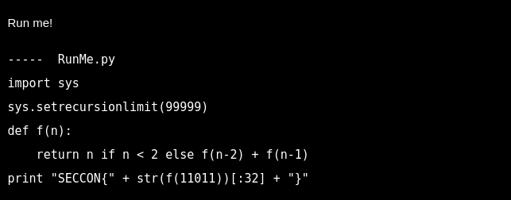
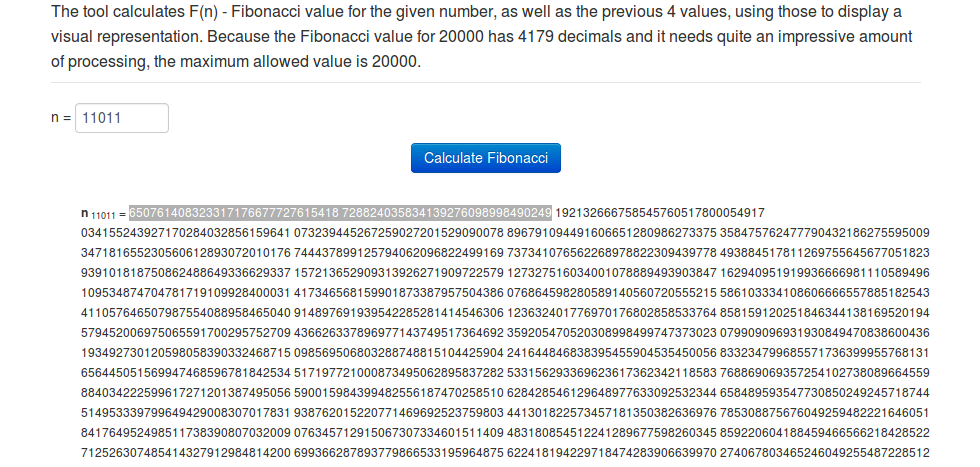

# Run Me!, Programming, 100pts

## Problem




## Solution

This is the code to find the nth Fibonacci number. But this will take a long time to compute.

So, we have two ways-  

1. Use an online calculator like [this](http://php.bubble.ro/fibonacci/).   

  

We take the first 32 characters as required in the problem, to get the flag `SECCON{65076140832331717667772761541872}`.

2. To find the value using code. We can use Java's BigIntegers to calculate the value of the fibonacci number.

```java
import java.math.BigInteger;

public class FibonacciNumber {

	public static void main(String[] args) {
		int number = 11011;

		BigInteger previous = new BigInteger("0");
		BigInteger present = new BigInteger("1");
		BigInteger next = new BigInteger("0");

		long startTime = System.nanoTime();

		for( int iterator = 2; iterator <= number ; iterator++){

			next = previous.add(present);
			previous = present;
			present = next;
		}

		long timeConsumed = System.nanoTime()-startTime;
		System.out.println("Iterative Method");
		System.out.println("Time Consumed = " + (timeConsumed/1000000) + " ms");
		System.out.println("F["+number+"] = " + next );

	}

}
```

Again we take the first 32 numbers of the obtained number to get the flag.
