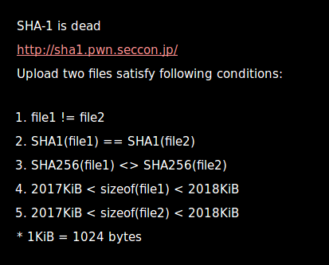
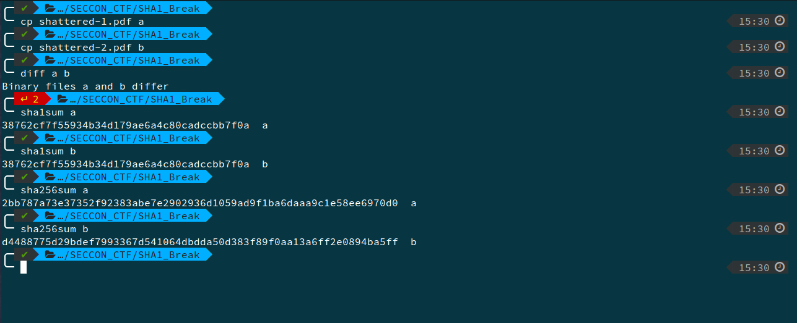
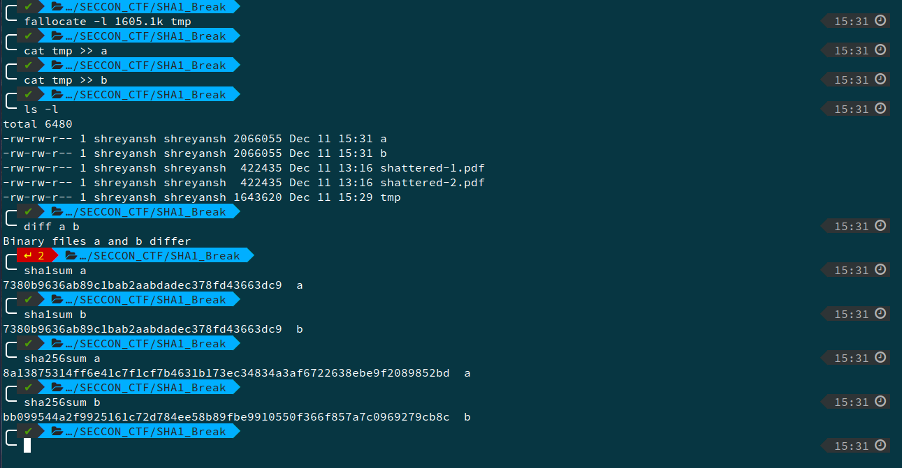
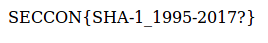

# SHA-1 is dead, Crypto, 100pts

## Problem

## Solution

We refer the [link](https://shattered.io/). Google had broken SHA1 hash and has declared it insecure. We download the two pdfs.

Then we the run the set of commands -

This ensures that although the files are different, but their SHA1 sum is same.

Then we allocate space equal to `2018k - 413k = 1605k` to meet the required file size.

This implies that adding some extra space to both files does not break our required conditions.

We upload the files and get the flag -

