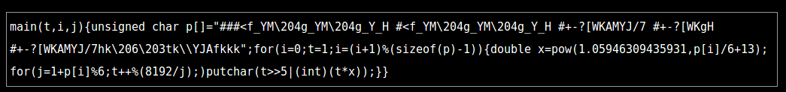

# putchar music, Programming, 100pts

## Problem

This one line of C program works on Linux Desktop. What is this movie's title?
Please answer the flag as SECCON{MOVIES_TITLE}, replace all alphabets with capital letters, and spaces with underscores.



## Solution

We copy the code and run it.   
```
gcc putchar_music.c - o putchar_music
./putchar_music
```
With this, we get a stream of numbers on our console. That doesn't help. Now, after reading the title of the problem, we run the output the code with a music player.  
We run    
```
./putchar_music | aplay
```
We hear the theme song of Star Wars being played.

So, the flag is `SECCON{START_WARS}`.
