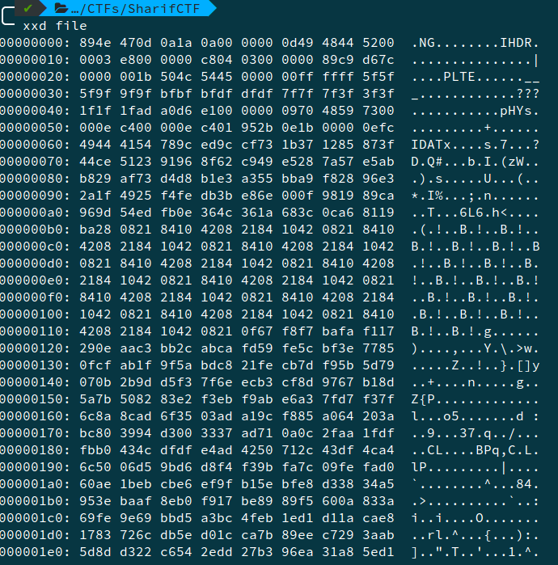
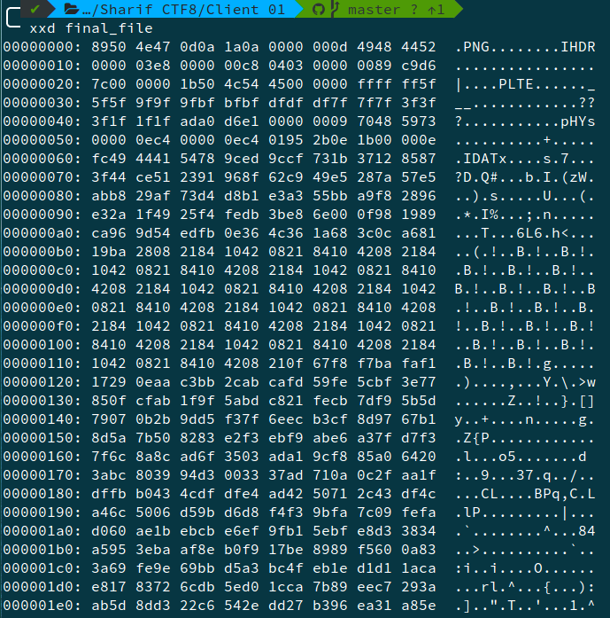

# Client 01, Forensics, 75pts

## Problem

Attached file is the homepage of the client01. He knows the flag.

## Solution

We first look at all the files (including hidden) using `ls -al`. Thereis nothing interesting here so we open `./.thunderbird/5bd7jhog.default/ImapMail/imap.gmail.com/INBOX`. There if we search for flag, we find a message with a [link](http://www.filehosting.org/file/details/720884/file). If we download the file from that link(by providing our email) and open it with a hex editor.

We find that we have a broken **PNG** header. We add **50**(P) in the hex editor.

The final generated image is -

