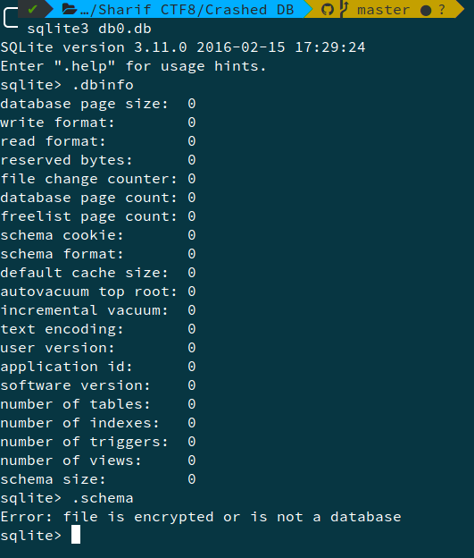
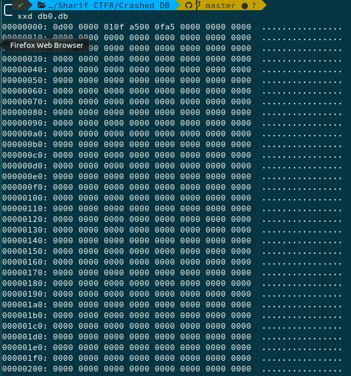
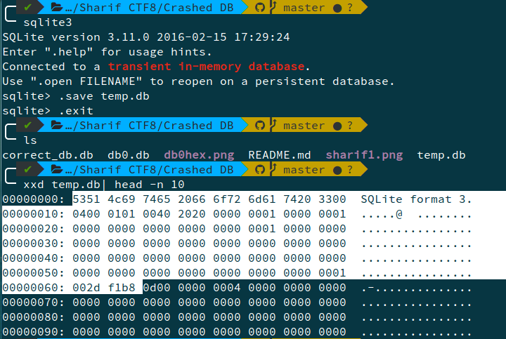
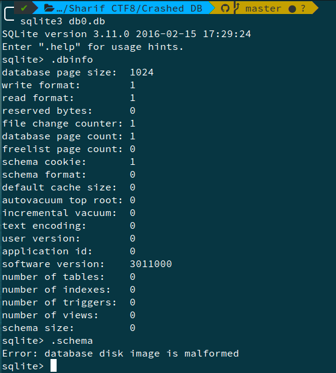
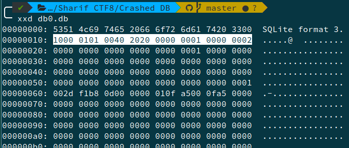
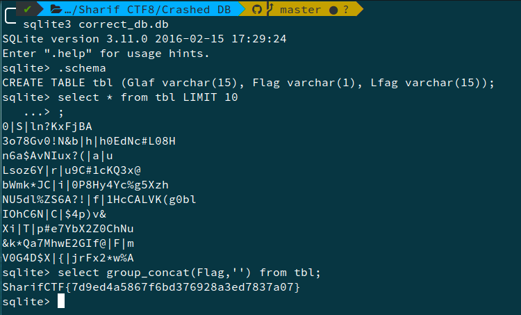

# Crashed DB, Forensics, 50pts

## Problem

We lost some data when we were delivering our DB. Can you recover it??

## Solution

We open it with sqlite3.

There seems to be some problem with the header. We use a hex editor to inspect -

We compare the headers with another SQLite3 db, temp.db.

We add the headers to db0.db as save it as `correct_db.db`. However, again on inspecting with sqlite3 we get `Error: database disk image is malformed`.

We observe that size of file is 8KB and page size is 1024 bytes. Changing page size and no. of pages to show,

Now opening, the db using sqlite3,

So, the flag is `SharifCTF{7d9ed4a5867f6bd376928a3ed7837a07}`
